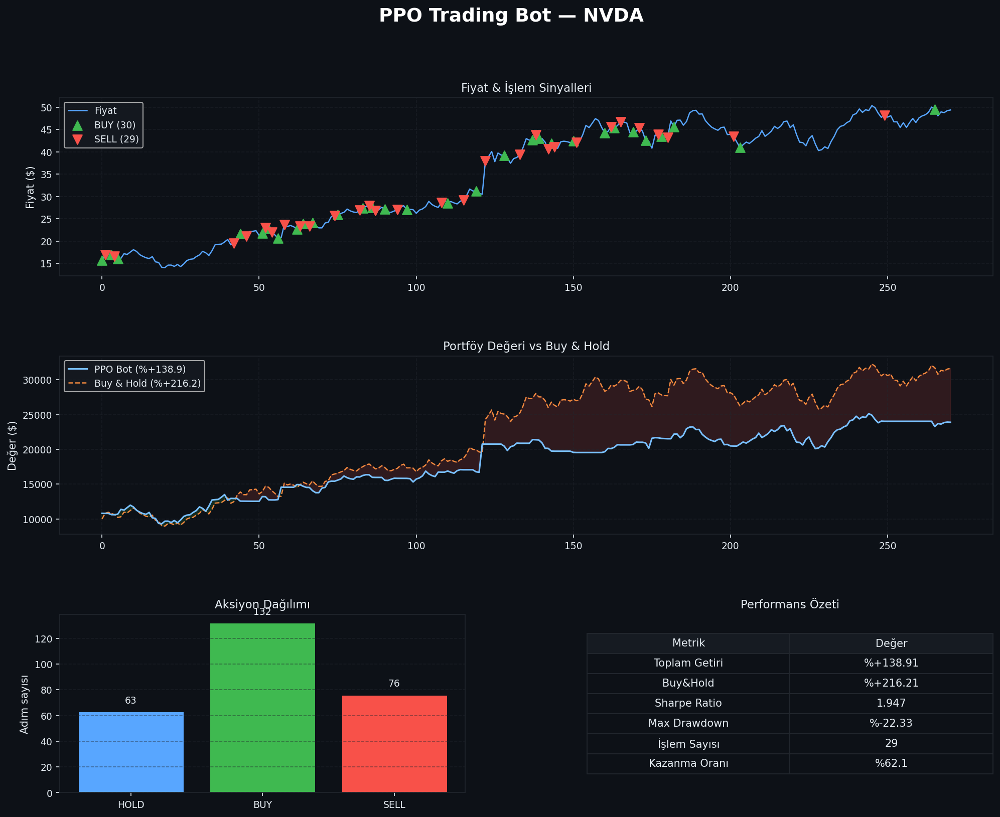

# 🤖 PPO Algorithmic Trading Bot

An autonomous trading agent that learns to trade stocks using **Proximal Policy Optimization (PPO)** reinforcement learning.

## Results

| Metric | AAPL | NVDA |
|--------|------|------|
| Total Return | +16.1% | +138.9% |
| Sharpe Ratio | 0.654 | 1.947 |
| Win Rate | 61.0% | 62.1% |
| Total Trades | 41 | 29 |



## Tech Stack

- **RL Algorithm**: PPO via `stable-baselines3`
- **Environment**: Custom `gymnasium` trading env
- **Indicators**: RSI, MACD, Bollinger Bands, EMA, ATR (16 total)
- **Data**: Yahoo Finance via `yfinance`
- **Monitoring**: TensorBoard

## Usage

```bash
pip install -r requirements.txt
python main.py --ticker NVDA --timesteps 500000 --mode both
```
